## 1. Epic Architecture Overview

The Core Plugin Infrastructure implements a build-time content transformation system using Vite's plugin API to convert Markdown files into type-safe virtual modules. The architecture follows a three-layer pattern:

**Content Layer** → **Processing Layer** → **Runtime Layer**

- **Content Layer**: File system structure (`content/`) containing Markdown files with YAML frontmatter
- **Processing Layer**: Vite plugins that discover, parse, transform, and compile content into virtual modules
- **Runtime Layer**: React components consuming virtual module exports as typed JavaScript constants

The system leverages Vite's module graph and HMR infrastructure to provide instant feedback during development while maintaining zero runtime overhead in production. All content parsing occurs at build time, generating static JavaScript modules that integrate seamlessly with Vite's bundling pipeline.

**Key Architectural Decisions:**

1. **Build-Time Processing**: Markdown parsing happens during Vite build, not in browser
2. **Virtual Module Pattern**: Content exposed as `virtual:*-data` modules using Vite's null-byte prefix convention
3. **Type-Safe Contracts**: TypeScript declarations ensure compile-time validation of content structure
4. **Plugin Pipeline**: Sequential processing through discover → parse → enrich → compile → export stages
5. **HMR Integration**: File watchers invalidate virtual module cache for <100ms updates

## 2. System Architecture Diagram

```mermaid
graph TB
    subgraph "Development Environment"
        DEV[Developer/AI Agent]
        EDITOR[IDE/Text Editor]
        DEV -->|Edits| EDITOR
    end

    subgraph "Content Layer"
        FS[File System]
        HOME[content/1-home/hero.md]
        ABOUT[content/2-about/About.md]
        SKILLS[content/2.5-skills/*.md]
        PROJECTS[content/3-projects/project-*.md]
        BLOGS[content/5-blogs/blog-*.md]
        CONTACT[content/6-contact/Contact.md]
        JOURNEY[content/learningJourney/term-*/*.md]
        
        EDITOR -->|Writes| FS
        FS --> HOME
        FS --> ABOUT
        FS --> SKILLS
        FS --> PROJECTS
        FS --> BLOGS
        FS --> CONTACT
        FS --> JOURNEY
    end

    subgraph "Processing Layer - Vite Build System"
        VITE[Vite Build Engine]
        
        subgraph "Plugin: contentDataPlugin.ts"
            RESOLVE1[resolveId Hook]
            LOAD1[load Hook]
            HMR1[handleHotUpdate Hook]
            
            PARSE_HOME[parseHome Function]
            PARSE_ABOUT[parseAbout Function]
            PARSE_SKILLS[parseSkills Function]
            PARSE_PROJECTS[parseProjects Function]
            PARSE_BLOGS[parseBlogs Function]
            PARSE_CONTACT[parseContact Function]
        end
        
        subgraph "Plugin: journeyDataPlugin.ts"
            RESOLVE2[resolveId Hook]
            LOAD2[load Hook]
            HMR2[handleHotUpdate Hook]
            
            PARSE_JOURNEY[parseJourney Function]
        end
        
        subgraph "Utility Layer"
            GRAY[gray-matter Library]
            SPLIT[splitSections Utility]
            EXTRACT[extractBullets Utility]
            ENSURE[ensureStringArray Utility]
            SLUG[slugFromPath Utility]
            ICON[getIconAndColor Utility]
        end
        
        VITE --> RESOLVE1
        VITE --> RESOLVE2
        
        RESOLVE1 --> LOAD1
        RESOLVE2 --> LOAD2
        
        HOME --> LOAD1
        ABOUT --> LOAD1
        SKILLS --> LOAD1
        PROJECTS --> LOAD1
        BLOGS --> LOAD1
        CONTACT --> LOAD1
        
        JOURNEY --> LOAD2
        
        LOAD1 --> PARSE_HOME
        LOAD1 --> PARSE_ABOUT
        LOAD1 --> PARSE_SKILLS
        LOAD1 --> PARSE_PROJECTS
        LOAD1 --> PARSE_BLOGS
        LOAD1 --> PARSE_CONTACT
        
        LOAD2 --> PARSE_JOURNEY
        
        PARSE_HOME --> GRAY
        PARSE_HOME --> SPLIT
        PARSE_HOME --> EXTRACT
        
        PARSE_PROJECTS --> GRAY
        PARSE_PROJECTS --> EXTRACT
        PARSE_PROJECTS --> SLUG
        
        PARSE_JOURNEY --> GRAY
        PARSE_JOURNEY --> ICON
        
        FS -.->|File Change| HMR1
        FS -.->|File Change| HMR2
    end

    subgraph "Virtual Module System"
        VM_HOME[virtual:home-data]
        VM_ABOUT[virtual:about-data]
        VM_SKILLS[virtual:skills-data]
        VM_PROJECTS[virtual:projects-data]
        VM_BLOGS[virtual:blogs-data]
        VM_CONTACT[virtual:contact-data]
        VM_JOURNEY[virtual:learning-journey-data]
        
        LOAD1 -->|Generates| VM_HOME
        LOAD1 -->|Generates| VM_ABOUT
        LOAD1 -->|Generates| VM_SKILLS
        LOAD1 -->|Generates| VM_PROJECTS
        LOAD1 -->|Generates| VM_BLOGS
        LOAD1 -->|Generates| VM_CONTACT
        
        LOAD2 -->|Generates| VM_JOURNEY
        
        HMR1 -.->|Invalidates| VM_HOME
        HMR1 -.->|Invalidates| VM_ABOUT
        HMR1 -.->|Invalidates| VM_SKILLS
        HMR1 -.->|Invalidates| VM_PROJECTS
        HMR1 -.->|Invalidates| VM_BLOGS
        HMR1 -.->|Invalidates| VM_CONTACT
        
        HMR2 -.->|Invalidates| VM_JOURNEY
    end

    subgraph "Type System"
        TYPES[src/types/virtual-modules.d.ts]
        INTERFACES[src/types/index.ts]
        
        TYPES -.->|Declares| VM_HOME
        TYPES -.->|Declares| VM_ABOUT
        TYPES -.->|Declares| VM_SKILLS
        TYPES -.->|Declares| VM_PROJECTS
        TYPES -.->|Declares| VM_BLOGS
        TYPES -.->|Declares| VM_CONTACT
        TYPES -.->|Declares| VM_JOURNEY
        
        INTERFACES -.->|Defines Schemas| TYPES
    end

    subgraph "Runtime Layer - React Application"
        RE_EXPORT[src/data/*.ts Re-export Layer]
        COMPONENTS[React Components]
        BROWSER[Browser Bundle]
        
        VM_HOME --> RE_EXPORT
        VM_ABOUT --> RE_EXPORT
        VM_SKILLS --> RE_EXPORT
        VM_PROJECTS --> RE_EXPORT
        VM_BLOGS --> RE_EXPORT
        VM_CONTACT --> RE_EXPORT
        VM_JOURNEY --> RE_EXPORT
        
        RE_EXPORT --> COMPONENTS
        COMPONENTS --> BROWSER
        
        HMR1 -.->|Updates| BROWSER
        HMR2 -.->|Updates| BROWSER
    end

    subgraph "Build Output"
        DIST[dist/ Directory]
        JS_BUNDLE[JavaScript Bundles]
        
        VITE -->|Production Build| DIST
        DIST --> JS_BUNDLE
        
        VM_HOME -.->|Inlined| JS_BUNDLE
        VM_ABOUT -.->|Inlined| JS_BUNDLE
        VM_SKILLS -.->|Inlined| JS_BUNDLE
        VM_PROJECTS -.->|Inlined| JS_BUNDLE
        VM_BLOGS -.->|Inlined| JS_BUNDLE
        VM_CONTACT -.->|Inlined| JS_BUNDLE
        VM_JOURNEY -.->|Inlined| JS_BUNDLE
    end

    style DEV fill:#e1f5ff
    style EDITOR fill:#e1f5ff
    style FS fill:#fff4e6
    style HOME fill:#fff4e6
    style ABOUT fill:#fff4e6
    style SKILLS fill:#fff4e6
    style PROJECTS fill:#fff4e6
    style BLOGS fill:#fff4e6
    style CONTACT fill:#fff4e6
    style JOURNEY fill:#fff4e6
    style VITE fill:#f3e5f5
    style RESOLVE1 fill:#f3e5f5
    style LOAD1 fill:#f3e5f5
    style HMR1 fill:#f3e5f5
    style RESOLVE2 fill:#f3e5f5
    style LOAD2 fill:#f3e5f5
    style HMR2 fill:#f3e5f5
    style GRAY fill:#e8f5e9
    style SPLIT fill:#e8f5e9
    style EXTRACT fill:#e8f5e9
    style ENSURE fill:#e8f5e9
    style SLUG fill:#e8f5e9
    style ICON fill:#e8f5e9
    style VM_HOME fill:#e3f2fd
    style VM_ABOUT fill:#e3f2fd
    style VM_SKILLS fill:#e3f2fd
    style VM_PROJECTS fill:#e3f2fd
    style VM_BLOGS fill:#e3f2fd
    style VM_CONTACT fill:#e3f2fd
    style VM_JOURNEY fill:#e3f2fd
    style TYPES fill:#fce4ec
    style INTERFACES fill:#fce4ec
    style COMPONENTS fill:#fff9c4
    style BROWSER fill:#fff9c4
    style DIST fill:#efebe9
    style JS_BUNDLE fill:#efebe9
```



## 3. High-Level Features & Technical Enablers

### High-Level Features

#### F1: Vite Plugin Core Infrastructure

**Description:** Implement Vite plugin with lifecycle hooks for virtual module management

**Components:**

- `contentDataPlugin.ts` - Main plugin for 6 content sections (Home, About, Skills, Projects, Blogs, Contact)
- `journeyDataPlugin.ts` - Dedicated plugin for Learning Journey section
- Plugin registration in `vite.config.ts`

**Technical Details:**

- `resolveId` hook: Map `virtual:*-data` imports to internal IDs with null-byte prefix (`\0virtual:*-data`)
- `load` hook: Read files, invoke parsers, serialize to JavaScript module exports
- `handleHotUpdate` hook: Detect file changes, invalidate module cache, trigger HMR

#### F2: Markdown File Discovery & Reading

**Description:** File system traversal and content loading

**Components:**

- Recursive directory scanning for `content/` subdirectories
- File filtering (skip `*spec.md`, `*Spec.md`)
- Synchronous file reading using Node.js `fs` module

**Technical Details:**

- Security: Restrict file reading to `content/` directory subtree
- Error handling: Log warnings for missing/unreadable files, continue processing
- Path normalization: Convert Windows/Unix paths to consistent format

#### F3: Content Parsing Pipeline

**Description:** Transform raw Markdown into structured data objects

**Components:**

- YAML frontmatter extraction using `gray-matter`
- Markdown section splitting by `## Heading` delimiters
- Bullet list extraction for array fields
- Data validation and default value assignment

**Technical Details:**

- Parser function signature: `(file: MarkdownFile) => T | null`
- Validation: Required field checks, enum validation, type coercion
- Error handling: Return `null` for invalid files, log descriptive warnings

#### F4: Section-Specific Parsers

**Description:** Dedicated parser implementations for each content type

**Parsers:**

- `parseHome`: Single-file, extracts hero content and CTAs
- `parseAbout`: Single-file, extracts narrative and values
- `parseSkills`: Multi-file aggregation, category-based grouping
- `parseProjects`: Multi-file, slug-based ID generation
- `parseBlogs`: Multi-file, draft filtering logic
- `parseContact`: Single-file, URL synthesis for email/phone
- `parseJourney`: Recursive multi-file, icon/color enrichment, period-based sorting

**Technical Details:**

- Single vs Array parsers: Single returns `T | null`, Array returns `T[]`
- ID generation: Use `slugFromPath` for projects, blogs, journey
- Enrichment: Icon/color mapping for Learning Journey categories

#### F5: Utility Function Library

**Description:** Reusable helpers for content transformation

**Functions:**

- `splitSections(markdown: string)`: Parse Markdown by `## Heading` → `Record<string, string>`
- `extractBullets(block?: string)`: Extract `-` or `*` list items → `string[]`
- `ensureStringArray(value: any)`: Normalize to `string[]` from arrays, CSV strings, or empty
- `slugFromPath(filePath: string)`: Generate URL-safe ID from file path
- `getIconAndColor(category: string)`: Map category to emoji icon and Tailwind gradient

**Technical Details:**

- Pure functions: No side effects, testable in isolation
- Defensive programming: Handle `null`, `undefined`, unexpected types gracefully
- Performance: Optimized for hundreds of files without significant overhead

#### F6: Virtual Module Generation

**Description:** Serialize parsed data into JavaScript module code

**Components:**

- JSON serialization of data objects
- Module code generation with `export const` statements
- Integration with Vite's module graph for dependency tracking

**Technical Details:**

```javascript
// Pseudocode for virtual module generation
function generateVirtualModule(data) {
  const json = JSON.stringify(data, null, 2);
  return `export const projectsData = ${json};`;
}
```

- Null-byte prefix: `\0virtual:projects-data` signals virtual module to Vite
- Module invalidation: Track file dependencies for HMR

#### F7: TypeScript Type Declarations

**Description:** Provide compile-time type safety for virtual modules

**Components:**

- `src/types/virtual-modules.d.ts`: Declare each `virtual:*-data` module
- `src/types/index.ts`: Define data interfaces (HomeData, ProjectDataItem, etc.)

**Technical Details:**

```typescript
// Pseudocode for type declarations
declare module 'virtual:projects-data' {
  export const projectsData: ProjectDataItem[];
}

interface ProjectDataItem {
  id: string;
  title: string;
  description: string;
  technologies: string[];
  // ... additional fields
}
```

- IDE integration: Enable autocomplete and type checking in VSCode/WebStorm
- Build-time validation: TypeScript compiler verifies type correctness

#### F8: Hot Module Replacement (HMR)

**Description:** Instant content preview updates during development

**Components:**

- File watcher integration via `handleHotUpdate` hook
- Module graph invalidation for changed content files
- Browser update mechanism via Vite HMR protocol

**Technical Details:**

- Trigger: Detect Markdown file save events in `content/` directory
- Invalidation: Clear parsed data cache, re-run parser, update virtual module
- Update: Send HMR update to browser, React re-renders affected components
- Performance target: <100ms from file save to browser update

#### F9: Content Re-export Layer

**Description:** Optional fallback mechanism for graceful degradation

**Components:**

- `src/data/*.ts` files import from virtual modules
- Hardcoded fallback data for development safety
- Type-safe re-export with array/null checking

**Technical Details:**

```typescript
// Pseudocode for re-export pattern
import { projectsData } from 'virtual:projects-data';

const fallbackProjects: Project[] = [/* example data */];

export const projects: Project[] = 
  Array.isArray(projectsData) && projectsData.length 
    ? projectsData 
    : fallbackProjects;
```

- Rationale: Ensures UI never breaks during development/migration
- Removal: Can delete fallbacks once all content is migrated

### Technical Enablers

#### TE1: gray-matter Library

**Purpose:** YAML frontmatter parsing

**Integration:**

- Install: `npm install gray-matter --save-dev`
- Usage: `import matter from 'gray-matter'`
- Scope: Build-time only, not bundled in client

**Capabilities:**

- Parse YAML/TOML/JSON frontmatter
- Extract content body separately
- Configurable delimiters and options

#### TE2: Node.js File System APIs

**Purpose:** File reading and directory traversal

**APIs Used:**

- `fs.readFileSync`: Synchronous file reading
- `fs.readdirSync`: Directory listing
- `fs.statSync`: File metadata (directory vs file)
- `path.join`, `path.resolve`: Path manipulation

**Constraints:**

- Synchronous only: Simplifies plugin implementation
- Security: Restrict to `content/` directory

#### TE3: Vite Plugin API

**Purpose:** Build system integration

**Hooks Implemented:**

- `resolveId`: Virtual module ID resolution
- `load`: Module content generation
- `handleHotUpdate`: HMR invalidation

**Documentation:**

- [Vite Plugin API](https://vitejs.dev/guide/api-plugin.html)
- [Virtual Modules Convention](https://vitejs.dev/guide/api-plugin.html#virtual-modules-convention)

#### TE4: TypeScript Declaration Files

**Purpose:** Type safety for virtual modules

**Files:**

- `src/types/virtual-modules.d.ts`: Module declarations
- `src/types/index.ts`: Interface definitions
- `tsconfig.json`: Compiler configuration

**Requirements:**

- TypeScript 5+ for module augmentation support
- `strict: true` mode for full type checking

#### TE5: Development Tooling

**Tools:**

- **Vitest**: Unit testing framework (for future EPIC-003)
- **TypeScript Compiler**: Type checking (`tsc --noEmit`)
- **Vite Dev Server**: HMR infrastructure
- **VSCode/WebStorm**: IDE with TypeScript support

**Configuration:**

- `vite.config.ts`: Plugin registration, dev server settings
- `tsconfig.json`: Type checking rules, module resolution
- `package.json`: Script commands (`build`, `dev`, `type-check`)

## 4. Technology Stack

### Core Technologies

- **Vite 5.x**: Build system and plugin host
- **TypeScript 5+**: Type-safe language for plugin development
- **Node.js 18+**: Runtime for build scripts and plugin execution
- **React 18+**: UI framework consuming virtual module data

### Build-Time Dependencies

- **gray-matter**: YAML frontmatter parsing (`^4.0.3`)
- **@types/node**: Node.js type definitions

### Development Dependencies

- **Vitest**: Unit testing (prepared for EPIC-003)
- **@vitejs/plugin-react**: React integration for Vite
- **TypeScript**: Compiler and language server

### Infrastructure

- **Vercel**: Deployment platform (Node.js 18+ build environment)
- **Git**: Version control for content and code
- **npm/pnpm**: Package management

### Excluded Dependencies

❌ **Runtime Markdown Parsers**: No `marked`, `markdown-it`, `remark` in client bundle  
❌ **CMS Libraries**: No Contentful, Strapi, or similar  
❌ **Database**: No runtime data storage  

## 5. Technical Value

### Value Rating: **HIGH**

### Justification

#### Architectural Foundation

- Establishes reusable pattern for content transformation pipelines
- Demonstrates advanced Vite plugin development techniques
- Creates blueprint for similar file-based content systems

#### Performance Excellence

- Zero runtime overhead: All parsing at build time
- Optimal bundle size: No unnecessary dependencies in client
- HMR integration: Sub-100ms development feedback loops
- Scalable: Handles 100+ files with <2s processing time

#### Type Safety & Developer Experience

- Full TypeScript type safety across content pipeline
- IDE autocomplete and error detection for content structure
- Compile-time validation prevents runtime errors
- Clear separation of concerns: content vs code

#### Maintainability & Extensibility

- Modular plugin architecture: Easy to add new content sections
- Pure utility functions: Testable, reusable, composable
- Well-defined interfaces: Clear contracts between layers
- Documentation through code: Self-explanatory patterns

#### Knowledge Transfer Value

- Demonstrates professional-grade plugin development
- Showcases build-time optimization techniques
- Provides reference implementation for future projects
- Enables AI-assisted development through clear architecture

## 6. T-Shirt Size Estimate

### Size: **LARGE (L)**

### Breakdown

**Time Estimate:** 20-30 hours

**Complexity Factors:**

- **Vite Plugin Development** (8-10 hours):
  - Understanding Vite plugin API and lifecycle hooks
  - Implementing `resolveId`, `load`, `handleHotUpdate`
  - Debugging virtual module resolution issues
  - Testing HMR integration

- **Parser Implementation** (6-8 hours):
  - Writing 7 parser functions with validation logic
  - Handling edge cases (malformed YAML, missing fields)
  - Implementing utility functions
  - Testing with various Markdown formats

- **TypeScript Configuration** (2-3 hours):
  - Creating virtual module type declarations
  - Defining data interfaces
  - Ensuring IDE integration works correctly
  - Resolving type errors

- **Integration & Testing** (4-6 hours):
  - Plugin registration in `vite.config.ts`
  - End-to-end testing (file → parse → virtual module → component)
  - HMR verification
  - Performance benchmarking

- **Documentation & Polish** (2-3 hours):
  - Code comments and JSDoc
  - README updates
  - Example content files
  - Troubleshooting guide

**Risk Factors:**

- 🟡 **Medium**: Vite plugin API learning curve
- 🟢 **Low**: Markdown parsing (well-established libraries)
- 🟡 **Medium**: HMR debugging (can be finicky)
- 🟢 **Low**: TypeScript integration (standard patterns)

**Dependencies:**

- ✅ No external blockers
- ✅ All required libraries available
- ✅ Clear specification exists

**Confidence Level:** High (well-scoped, proven technologies)

---

**Version:** 1.0 | **Status:** Draft | **Last Updated:** Dec 09 2025 - 11:30
