## 1. Epic Architecture Overview

The Testing & Validation Infrastructure epic establishes a comprehensive testing pyramid to ensure the Markdown content pipeline system operates reliably across all environments. The architecture implements a layered testing strategy that validates the system from individual utility functions through complete user workflows.

**Testing Pyramid Strategy:**

```
        /\
       /E2E\       End-to-End (10% coverage)
      /------\     Browser-level user scenarios
     /Integ'n\    Integration (20% coverage)
    /----------\   Plugin-to-component data flow
   /   Unit     \  Unit (70% coverage)
  /--------------\ Function-level validation
```

**Key Architectural Principles:**

1. **Test Data Isolation**: Dedicated fixtures prevent production content interference
2. **Build-Time Testing**: Validate plugins and parsers in Vite build environment
3. **Performance Budgets**: Enforce Lighthouse 90+ scores via CI
4. **Regression Prevention**: Automated checks prevent breaking changes
5. **CI/CD Integration**: All tests run automatically on push/PR

The architecture ensures every layer of the content pipeline is validated: utilities → parsers → virtual modules → React components → full page rendering → performance metrics.

## 2. System Architecture Diagram

```mermaid
graph TB
    subgraph "Test Development Layer"
        DEV[Developer/AI Agent]
        TESTSPEC[Test Specifications]
        
        DEV -->|Writes Tests| TESTSPEC
    end

    subgraph "Test Fixtures & Data"
        FIXTURES[Test Fixtures]
        
        subgraph "Unit Test Fixtures"
            FIX_MD[Sample Markdown Files]
            FIX_YAML[Sample YAML Frontmatter]
            FIX_JSON[Expected JSON Outputs]
        end
        
        subgraph "Integration Fixtures"
            FIX_CONTENT[content-test/ Directory]
            FIX_BUILD[Vite Test Config]
        end
        
        subgraph "E2E Fixtures"
            FIX_PAGES[Test Pages]
            FIX_DATA[Mock API Responses]
        end
        
        FIXTURES --> FIX_MD
        FIXTURES --> FIX_YAML
        FIXTURES --> FIX_JSON
        FIXTURES --> FIX_CONTENT
        FIXTURES --> FIX_BUILD
        FIXTURES --> FIX_PAGES
        FIXTURES --> FIX_DATA
    end

    subgraph "Unit Testing Layer - Vitest"
        VITEST[Vitest Test Runner]
        
        subgraph "Utility Tests"
            TEST_SPLIT[splitSections.test.ts]
            TEST_EXTRACT[extractBullets.test.ts]
            TEST_SLUG[slugFromPath.test.ts]
            TEST_ICON[getIconAndColor.test.ts]
        end
        
        subgraph "Parser Tests"
            TEST_PARSE_HOME[parseHome.test.ts]
            TEST_PARSE_ABOUT[parseAbout.test.ts]
            TEST_PARSE_SKILLS[parseSkills.test.ts]
            TEST_PARSE_PROJECTS[parseProjects.test.ts]
            TEST_PARSE_BLOGS[parseBlogs.test.ts]
            TEST_PARSE_CONTACT[parseContact.test.ts]
            TEST_PARSE_JOURNEY[parseJourney.test.ts]
        end
        
        subgraph "Type Tests"
            TEST_TYPES[typeValidation.test.ts]
            TEST_SCHEMA[schemaCompliance.test.ts]
        end
        
        FIX_MD --> VITEST
        FIX_YAML --> VITEST
        FIX_JSON --> VITEST
        
        VITEST --> TEST_SPLIT
        VITEST --> TEST_EXTRACT
        VITEST --> TEST_SLUG
        VITEST --> TEST_ICON
        VITEST --> TEST_PARSE_HOME
        VITEST --> TEST_PARSE_ABOUT
        VITEST --> TEST_PARSE_SKILLS
        VITEST --> TEST_PARSE_PROJECTS
        VITEST --> TEST_PARSE_BLOGS
        VITEST --> TEST_PARSE_CONTACT
        VITEST --> TEST_PARSE_JOURNEY
        VITEST --> TEST_TYPES
        VITEST --> TEST_SCHEMA
    end

    subgraph "Integration Testing Layer - Vitest + Vite"
        INT_TEST[Integration Test Suite]
        
        subgraph "Plugin Integration Tests"
            TEST_PLUGIN_LOAD[Plugin Load Hook Test]
            TEST_PLUGIN_RESOLVE[Plugin ResolveId Test]
            TEST_PLUGIN_HMR[Plugin HMR Test]
        end
        
        subgraph "Virtual Module Tests"
            TEST_VM_HOME[virtual:home-data Test]
            TEST_VM_ABOUT[virtual:about-data Test]
            TEST_VM_SKILLS[virtual:skills-data Test]
            TEST_VM_PROJECTS[virtual:projects-data Test]
            TEST_VM_BLOGS[virtual:blogs-data Test]
            TEST_VM_CONTACT[virtual:contact-data Test]
            TEST_VM_JOURNEY[virtual:learning-journey-data Test]
        end
        
        subgraph "Build Integration Tests"
            TEST_BUILD_SUCCESS[Build Success Test]
            TEST_BUILD_PERF[Build Performance Test]
            TEST_TYPE_CHECK[TypeScript Check Test]
        end
        
        FIX_CONTENT --> INT_TEST
        FIX_BUILD --> INT_TEST
        
        INT_TEST --> TEST_PLUGIN_LOAD
        INT_TEST --> TEST_PLUGIN_RESOLVE
        INT_TEST --> TEST_PLUGIN_HMR
        INT_TEST --> TEST_VM_HOME
        INT_TEST --> TEST_VM_ABOUT
        INT_TEST --> TEST_VM_SKILLS
        INT_TEST --> TEST_VM_PROJECTS
        INT_TEST --> TEST_VM_BLOGS
        INT_TEST --> TEST_VM_CONTACT
        INT_TEST --> TEST_VM_JOURNEY
        INT_TEST --> TEST_BUILD_SUCCESS
        INT_TEST --> TEST_BUILD_PERF
        INT_TEST --> TEST_TYPE_CHECK
    end

    subgraph "E2E Testing Layer - Playwright"
        PLAYWRIGHT[Playwright Test Runner]
        
        subgraph "Section Rendering Tests"
            E2E_HOME[Home Section E2E]
            E2E_ABOUT[About Section E2E]
            E2E_SKILLS[Skills Section E2E]
            E2E_PROJECTS[Projects Section E2E]
            E2E_BLOGS[Blogs Section E2E]
            E2E_CONTACT[Contact Section E2E]
            E2E_JOURNEY[Journey Section E2E]
        end
        
        subgraph "User Journey Tests"
            E2E_NAV[Navigation Flow Test]
            E2E_SCROLL[Scroll Animations Test]
            E2E_INTERACT[Interactive Elements Test]
        end
        
        subgraph "Accessibility Tests"
            E2E_A11Y_KEYBOARD[Keyboard Navigation]
            E2E_A11Y_SCREEN[Screen Reader Support]
            E2E_A11Y_ARIA[ARIA Labels Validation]
        end
        
        FIX_PAGES --> PLAYWRIGHT
        FIX_DATA --> PLAYWRIGHT
        
        PLAYWRIGHT --> E2E_HOME
        PLAYWRIGHT --> E2E_ABOUT
        PLAYWRIGHT --> E2E_SKILLS
        PLAYWRIGHT --> E2E_PROJECTS
        PLAYWRIGHT --> E2E_BLOGS
        PLAYWRIGHT --> E2E_CONTACT
        PLAYWRIGHT --> E2E_JOURNEY
        PLAYWRIGHT --> E2E_NAV
        PLAYWRIGHT --> E2E_SCROLL
        PLAYWRIGHT --> E2E_INTERACT
        PLAYWRIGHT --> E2E_A11Y_KEYBOARD
        PLAYWRIGHT --> E2E_A11Y_SCREEN
        PLAYWRIGHT --> E2E_A11Y_ARIA
    end

    subgraph "Performance Testing Layer - Lighthouse CI"
        LHCI[Lighthouse CI]
        
        subgraph "Performance Metrics"
            LH_PERF[Performance ≥90]
            LH_A11Y[Accessibility ≥90]
            LH_BP[Best Practices ≥90]
            LH_SEO[SEO ≥90]
        end
        
        subgraph "Budget Enforcement"
            LH_BUDGET_JS[JavaScript Budget]
            LH_BUDGET_CSS[CSS Budget]
            LH_BUDGET_IMG[Image Budget]
        end
        
        LHCI --> LH_PERF
        LHCI --> LH_A11Y
        LHCI --> LH_BP
        LHCI --> LH_SEO
        LHCI --> LH_BUDGET_JS
        LHCI --> LH_BUDGET_CSS
        LHCI --> LH_BUDGET_IMG
    end

    subgraph "Coverage Reporting"
        COVERAGE[Coverage Tools]
        
        subgraph "Coverage Metrics"
            COV_LINE[Line Coverage ≥80%]
            COV_BRANCH[Branch Coverage ≥75%]
            COV_FUNC[Function Coverage ≥80%]
        end
        
        subgraph "Coverage Reports"
            COV_HTML[HTML Report]
            COV_JSON[JSON Report]
            COV_LCOV[LCOV for CI]
        end
        
        VITEST -.->|Generates| COVERAGE
        INT_TEST -.->|Generates| COVERAGE
        
        COVERAGE --> COV_LINE
        COVERAGE --> COV_BRANCH
        COVERAGE --> COV_FUNC
        COVERAGE --> COV_HTML
        COVERAGE --> COV_JSON
        COVERAGE --> COV_LCOV
    end

    subgraph "CI/CD Integration Layer - GitHub Actions"
        CICD[GitHub Actions Workflows]
        
        subgraph "PR Checks Workflow"
            CI_UNIT[Run Unit Tests]
            CI_INT[Run Integration Tests]
            CI_TYPE[Run TypeScript Check]
            CI_LINT[Run ESLint]
            CI_BUILD[Run Production Build]
        end
        
        subgraph "Main Branch Workflow"
            CI_E2E[Run E2E Tests]
            CI_LH[Run Lighthouse CI]
            CI_COV[Upload Coverage]
        end
        
        subgraph "Quality Gates"
            GATE_TESTS[All Tests Pass]
            GATE_COV[Coverage ≥80%]
            GATE_LH[Lighthouse ≥90]
            GATE_BUILD[Build Success]
        end
        
        CICD --> CI_UNIT
        CICD --> CI_INT
        CICD --> CI_TYPE
        CICD --> CI_LINT
        CICD --> CI_BUILD
        CICD --> CI_E2E
        CICD --> CI_LH
        CICD --> CI_COV
        
        CI_UNIT --> GATE_TESTS
        CI_INT --> GATE_TESTS
        CI_E2E --> GATE_TESTS
        CI_COV --> GATE_COV
        CI_LH --> GATE_LH
        CI_BUILD --> GATE_BUILD
    end

    subgraph "Test Results Layer"
        RESULTS[Test Results Dashboard]
        
        subgraph "Reporting Outputs"
            OUT_CONSOLE[Console Output]
            OUT_HTML[HTML Reports]
            OUT_ARTIFACTS[CI Artifacts]
            OUT_BADGES[README Badges]
        end
        
        GATE_TESTS --> RESULTS
        GATE_COV --> RESULTS
        GATE_LH --> RESULTS
        GATE_BUILD --> RESULTS
        
        RESULTS --> OUT_CONSOLE
        RESULTS --> OUT_HTML
        RESULTS --> OUT_ARTIFACTS
        RESULTS --> OUT_BADGES
    end

    style DEV fill:#e1f5ff
    style TESTSPEC fill:#e1f5ff
    style FIXTURES fill:#fff4e6
    style FIX_MD fill:#fff4e6
    style FIX_YAML fill:#fff4e6
    style FIX_JSON fill:#fff4e6
    style FIX_CONTENT fill:#fff4e6
    style FIX_BUILD fill:#fff4e6
    style FIX_PAGES fill:#fff4e6
    style FIX_DATA fill:#fff4e6
    style VITEST fill:#e8f5e9
    style INT_TEST fill:#e8f5e9
    style PLAYWRIGHT fill:#f3e5f5
    style LHCI fill:#fff9c4
    style COVERAGE fill:#e3f2fd
    style CICD fill:#efebe9
    style RESULTS fill:#fce4ec
```



## 3. High-Level Features & Technical Enablers

### High-Level Features

#### F1: Unit Testing Infrastructure (Vitest)

**Description:** Comprehensive unit tests for all utility functions and parsers

**Test Categories:**

**Utility Function Tests:**

```typescript
// Pseudocode - splitSections.test.ts
describe('splitSections', () => {
  it('should split content by ## headings', () => {
    const input = `
## Section One
Content for section one

## Section Two
Content for section two
    `;
    
    const result = splitSections(input);
    
    expect(result).toEqual({
      'section one': 'Content for section one',
      'section two': 'Content for section two'
    });
  });
  
  it('should handle missing sections gracefully', () => {
    const result = splitSections('No sections here');
    expect(result).toEqual({});
  });
  
  it('should normalize heading casing', () => {
    const input = '## KEY LEARNINGS\n- Item 1';
    const result = splitSections(input);
    expect(result['key learnings']).toBe('- Item 1');
  });
});
```

**Parser Function Tests:**

```typescript
// Pseudocode - parseHome.test.ts
describe('parseHome', () => {
  it('should parse valid home content correctly', () => {
    const mockFile = {
      path: '/content/1-home/hero.md',
      content: `---
title: "John Doe | Full-Stack Developer"
subtitle: "Building performant, accessible web experiences"
ctaPrimary:
  label: "View Projects"
  href: "#projects"
---

## Highlights
- Performance-first development
- WCAG AA accessibility
      `
    };
    
    const result = parseHome(mockFile);
    
    expect(result).toMatchObject({
      id: expect.any(String),
      title: "John Doe | Full-Stack Developer",
      subtitle: "Building performant, accessible web experiences",
      ctaPrimary: { label: "View Projects", href: "#projects" },
      highlights: ["Performance-first development", "WCAG AA accessibility"]
    });
  });
  
  it('should return null for missing required title', () => {
    const mockFile = {
      path: '/content/1-home/hero.md',
      content: '---\nsubtitle: "No title"\n---'
    };
    
    const result = parseHome(mockFile);
    expect(result).toBeNull();
  });
  
  it('should handle optional fields gracefully', () => {
    const mockFile = {
      path: '/content/1-home/hero.md',
      content: '---\ntitle: "Minimal"\n---'
    };
    
    const result = parseHome(mockFile);
    
    expect(result).toMatchObject({
      title: "Minimal",
      subtitle: undefined,
      ctaPrimary: undefined
    });
  });
});
```

**Coverage Targets:**

- Utilities: 90%+ coverage (critical infrastructure)
- Parsers: 85%+ coverage (complex logic)
- Types: 100% type-checking (no `any` usage)

#### F2: Integration Testing (Plugin & Virtual Modules)

**Description:** Test Vite plugins in realistic build environment

**Test Strategy:**

**Plugin Hook Tests:**

```typescript
// Pseudocode - contentDataPlugin.test.ts
describe('contentDataPlugin - resolveId hook', () => {
  it('should resolve virtual module IDs with null-byte prefix', () => {
    const plugin = contentDataPlugin();
    
    const result = plugin.resolveId('virtual:home-data');
    
    expect(result).toBe('\0virtual:home-data');
  });
  
  it('should return null for non-virtual imports', () => {
    const plugin = contentDataPlugin();
    
    const result = plugin.resolveId('react');
    
    expect(result).toBeNull();
  });
});

describe('contentDataPlugin - load hook', () => {
  it('should load home data from test fixtures', async () => {
    const plugin = contentDataPlugin({ contentDir: './fixtures/content-test' });
    
    const result = await plugin.load('\0virtual:home-data');
    
    expect(result).toContain('export const homeData =');
    expect(result).toContain('"title":');
  });
  
  it('should return null for missing content', async () => {
    const plugin = contentDataPlugin({ contentDir: './empty' });
    
    const result = await plugin.load('\0virtual:home-data');
    
    expect(result).toContain('export const homeData = null;');
  });
});
```

**Virtual Module Tests:**

```typescript
// Pseudocode - virtualModules.integration.test.ts
describe('Virtual Module Integration', () => {
  it('should import all seven virtual modules successfully', async () => {
    // Uses actual Vite build with test fixtures
    const modules = await Promise.all([
      import('virtual:home-data'),
      import('virtual:about-data'),
      import('virtual:skills-data'),
      import('virtual:projects-data'),
      import('virtual:blogs-data'),
      import('virtual:contact-data'),
      import('virtual:learning-journey-data')
    ]);
    
    modules.forEach((mod, idx) => {
      expect(mod).toBeDefined();
      // Each module exports specific typed data
    });
  });
});
```

**Build Integration Tests:**

```typescript
// Pseudocode - buildPerformance.test.ts
describe('Build Performance', () => {
  it('should build 100 files in under 2 seconds', async () => {
    const startTime = Date.now();
    
    await runViteBuild({ contentDir: './fixtures/large-dataset' });
    
    const duration = Date.now() - startTime;
    expect(duration).toBeLessThan(2000);
  });
  
  it('should produce bundle with no runtime parsers', async () => {
    const bundle = await runViteBuild();
    const jsCode = bundle['main.js'].code;
    
    expect(jsCode).not.toContain('gray-matter');
    expect(jsCode).not.toContain('parseHome');
  });
});
```

**Coverage Targets:**

- Plugin hooks: 100% coverage (all code paths)
- Virtual modules: 100% coverage (all 7 modules)
- Build integration: Key scenarios covered

#### F3: End-to-End Testing (Playwright)

**Description:** Browser-level validation of complete user workflows

**Test Scenarios:**

**Section Rendering Tests:**

```typescript
// Pseudocode - home.e2e.test.ts
test.describe('Home Section', () => {
  test('should render hero content from Markdown', async ({ page }) => {
    await page.goto('http://localhost:5173');
    
    // Verify content from virtual:home-data appears
    await expect(page.locator('h1')).toContainText('John Doe');
    await expect(page.locator('[data-testid="hero-subtitle"]'))
      .toContainText('Full-Stack Developer');
    
    // Verify CTA buttons
    const ctaPrimary = page.locator('[data-testid="cta-primary"]');
    await expect(ctaPrimary).toHaveText('View Projects');
    await expect(ctaPrimary).toHaveAttribute('href', '#projects');
  });
  
  test('should render highlights from Markdown', async ({ page }) => {
    await page.goto('http://localhost:5173');
    
    const highlights = page.locator('[data-testid="highlights"] li');
    
    await expect(highlights).toHaveCount(3);
    await expect(highlights.first()).toContainText('Performance-first');
  });
});
```

**User Journey Tests:**

```typescript
// Pseudocode - navigation.e2e.test.ts
test.describe('Navigation Flow', () => {
  test('should navigate through all sections via menu', async ({ page }) => {
    await page.goto('http://localhost:5173');
    
    // Navigate to Projects
    await page.click('nav a[href="#projects"]');
    await expect(page.locator('#projects')).toBeInViewport();
    
    // Navigate to Blogs
    await page.click('nav a[href="#blogs"]');
    await expect(page.locator('#blogs')).toBeInViewport();
    
    // Verify content from Markdown appears
    const blogCard = page.locator('[data-testid="blog-card"]').first();
    await expect(blogCard).toContainText('Markdown Content Pipeline');
  });
});
```

**Accessibility Tests:**

```typescript
// Pseudocode - accessibility.e2e.test.ts
test.describe('Accessibility Compliance', () => {
  test('should support keyboard navigation', async ({ page }) => {
    await page.goto('http://localhost:5173');
    
    // Tab through interactive elements
    await page.keyboard.press('Tab');
    const focused = page.locator(':focus');
    
    // Verify first focusable element is nav link or CTA
    await expect(focused).toHaveAttribute('href');
  });
  
  test('should have proper ARIA labels', async ({ page }) => {
    await page.goto('http://localhost:5173');
    
    // Verify sections have aria-labelledby
    const aboutSection = page.locator('#about');
    await expect(aboutSection).toHaveAttribute('aria-labelledby');
    
    // Verify interactive elements have labels
    const contactButton = page.locator('[data-testid="contact-button"]');
    await expect(contactButton).toHaveAttribute('aria-label');
  });
});
```

**Test Organization:**

- 7 section-specific test files (one per content section)
- 3 user journey test files (navigation, interactions, animations)
- 2 accessibility test files (keyboard, screen readers)

**Coverage Targets:**

- All 7 sections rendered correctly
- All navigation flows functional
- WCAG AA compliance verified

#### F4: Performance Testing (Lighthouse CI)

**Description:** Automated performance budget enforcement

**Lighthouse Configuration:**

```javascript
// Pseudocode - lighthouserc.json
{
  "ci": {
    "collect": {
      "numberOfRuns": 3,
      "url": ["http://localhost:5173"],
      "settings": {
        "preset": "desktop"
      }
    },
    "assert": {
      "assertions": {
        "categories:performance": ["error", { "minScore": 0.9 }],
        "categories:accessibility": ["error", { "minScore": 0.9 }],
        "categories:best-practices": ["error", { "minScore": 0.9 }],
        "categories:seo": ["error", { "minScore": 0.9 }],
        
        // Resource budgets
        "resource-summary:script:size": ["error", { "maxNumericValue": 300000 }],
        "resource-summary:stylesheet:size": ["error", { "maxNumericValue": 100000 }],
        "resource-summary:image:size": ["error", { "maxNumericValue": 500000 }],
        
        // Performance metrics
        "first-contentful-paint": ["error", { "maxNumericValue": 1800 }],
        "largest-contentful-paint": ["error", { "maxNumericValue": 2500 }],
        "cumulative-layout-shift": ["error", { "maxNumericValue": 0.1 }],
        "total-blocking-time": ["error", { "maxNumericValue": 300 }]
      }
    },
    "upload": {
      "target": "temporary-public-storage"
    }
  }
}
```

**Test Workflow:**

1. Build production bundle
2. Start preview server
3. Run Lighthouse CI (3 runs, median scores)
4. Assert budgets and thresholds
5. Generate HTML reports
6. Upload results to GitHub Actions artifacts

**Performance Targets:**

- Performance: ≥90
- Accessibility: ≥90
- Best Practices: ≥90
- SEO: ≥90
- FCP: ≤1.8s
- LCP: ≤2.5s
- CLS: ≤0.1
- TBT: ≤300ms

#### F5: CI/CD Pipeline Integration

**Description:** Automated test execution on every commit

**GitHub Actions Workflow:**

```yaml
# Pseudocode - .github/workflows/test.yml
name: Test Pipeline

on:
  push:
    branches: [main, develop]
  pull_request:
    branches: [main]

jobs:
  unit-tests:
    runs-on: ubuntu-latest
    steps:
      - uses: actions/checkout@v4
      - uses: actions/setup-node@v4
        with:
          node-version: '18'
      
      - run: npm ci
      - run: npm run test:unit -- --coverage
      
      - name: Upload coverage
        uses: codecov/codecov-action@v3
        with:
          files: ./coverage/lcov.info

  integration-tests:
    runs-on: ubuntu-latest
    steps:
      - uses: actions/checkout@v4
      - uses: actions/setup-node@v4
      
      - run: npm ci
      - run: npm run test:integration
      
      - name: Check TypeScript
        run: npx tsc --noEmit

  e2e-tests:
    runs-on: ubuntu-latest
    steps:
      - uses: actions/checkout@v4
      - uses: actions/setup-node@v4
      
      - run: npm ci
      - run: npx playwright install --with-deps
      - run: npm run build
      - run: npm run test:e2e
      
      - name: Upload Playwright report
        if: always()
        uses: actions/upload-artifact@v3
        with:
          name: playwright-report
          path: playwright-report/

  lighthouse-ci:
    runs-on: ubuntu-latest
    steps:
      - uses: actions/checkout@v4
      - uses: actions/setup-node@v4
      
      - run: npm ci
      - run: npm run build
      - run: npm run preview &
      
      - name: Run Lighthouse CI
        run: npx @lhci/cli@latest autorun
      
      - name: Upload Lighthouse results
        uses: actions/upload-artifact@v3
        with:
          name: lighthouse-report
          path: .lighthouseci/

  quality-gates:
    needs: [unit-tests, integration-tests, e2e-tests, lighthouse-ci]
    runs-on: ubuntu-latest
    steps:
      - run: echo "All quality gates passed ✅"
```

**Quality Gates:**

- ✅ All unit tests pass (≥80% coverage)
- ✅ All integration tests pass
- ✅ All E2E tests pass
- ✅ TypeScript compilation succeeds
- ✅ Lighthouse scores ≥90
- ✅ Build succeeds

**Branch Protection:**

- Require status checks before merge
- Require 1 approving review
- Block merge if tests fail

#### F6: Test Data Management

**Description:** Organized fixtures preventing production interference

**Directory Structure:**

```
tests/
├── fixtures/
│   ├── content-test/               # Integration test content
│   │   ├── 1-home/
│   │   │   └── hero.md
│   │   ├── 2-about/
│   │   │   └── About.md
│   │   ├── 2.5-skills/
│   │   │   ├── react.md
│   │   │   └── typescript.md
│   │   ├── 3-projects/
│   │   │   └── project-example.md
│   │   └── 5-blogs/
│   │       └── blog-example.md
│   │
│   ├── markdown-samples/           # Unit test samples
│   │   ├── valid-frontmatter.md
│   │   ├── invalid-yaml.md
│   │   ├── missing-fields.md
│   │   └── edge-cases.md
│   │
│   └── expected-outputs/           # Expected JSON results
│       ├── home-expected.json
│       ├── projects-expected.json
│       └── journey-expected.json
│
├── unit/
│   ├── utils/
│   └── parsers/
│
├── integration/
│   ├── plugins/
│   └── virtualModules/
│
└── e2e/
    ├── sections/
    ├── navigation/
    └── accessibility/
```

**Fixture Principles:**

- Realistic but not production data
- Version controlled (committed to Git)
- Self-documenting (clear naming)
- Minimal (only what tests need)
- Isolated (no shared state between tests)

#### F7: Coverage Reporting & Monitoring

**Description:** Track test coverage trends over time

**Coverage Tools:**

- Vitest built-in coverage (via c8)
- Codecov integration for trend visualization
- PR comments with coverage diff

**Coverage Thresholds:**

```javascript
// Pseudocode - vitest.config.ts
export default defineConfig({
  test: {
    coverage: {
      provider: 'c8',
      reporter: ['text', 'json', 'html', 'lcov'],
      lines: 80,
      branches: 75,
      functions: 80,
      statements: 80,
      exclude: [
        'tests/**',
        '**/*.test.ts',
        '**/*.test.tsx',
        'vite.config.ts',
        'src/main.tsx'
      ]
    }
  }
});
```

**Reporting Outputs:**

- Console summary (CI logs)
- HTML report (local development)
- LCOV file (Codecov upload)
- JSON for custom tooling

### Technical Enablers

#### TE1: Vitest Testing Framework

**Description:** Fast unit testing with Vite integration

**Key Features:**

- Native ESM and TypeScript support
- Vite-compatible module resolution
- Built-in coverage reporting
- Watch mode for TDD workflow
- Snapshot testing for data structures

**Configuration:**

```typescript
// Pseudocode - vitest.config.ts
import { defineConfig } from 'vitest/config';
import react from '@vitejs/plugin-react';

export default defineConfig({
  plugins: [react()],
  test: {
    globals: true,
    environment: 'jsdom',
    setupFiles: ['./tests/setup.ts'],
    coverage: {
      provider: 'c8',
      reporter: ['text', 'json', 'html']
    }
  }
});
```

#### TE2: Playwright E2E Framework

**Description:** Cross-browser end-to-end testing

**Key Features:**

- Multi-browser support (Chromium, Firefox, WebKit)
- Auto-wait for elements
- Screenshot and video recording
- Network interception
- Accessibility testing helpers

**Configuration:**

```typescript
// Pseudocode - playwright.config.ts
import { defineConfig } from '@playwright/test';

export default defineConfig({
  testDir: './tests/e2e',
  fullyParallel: true,
  retries: process.env.CI ? 2 : 0,
  workers: process.env.CI ? 1 : undefined,
  reporter: 'html',
  use: {
    baseURL: 'http://localhost:5173',
    trace: 'on-first-retry',
    screenshot: 'only-on-failure'
  },
  projects: [
    { name: 'chromium', use: { browserName: 'chromium' } },
    { name: 'firefox', use: { browserName: 'firefox' } },
    { name: 'webkit', use: { browserName: 'webkit' } }
  ]
});
```

#### TE3: Lighthouse CI

**Description:** Automated performance budget enforcement

**Key Features:**

- Desktop and mobile audits
- Performance budgets
- Regression detection
- Historical trend tracking
- GitHub status checks

**Integration:**

- Runs on every PR
- Blocks merge if scores drop below thresholds
- Generates detailed HTML reports
- Uploads results to temporary storage

#### TE4: GitHub Actions CI/CD

**Description:** Workflow automation platform

**Key Features:**

- Matrix builds (multiple Node versions)
- Artifact uploads (test reports)
- Status checks (branch protection)
- Secrets management (API keys)
- Caching (node_modules, Playwright browsers)

**Workflow Organization:**

- `test.yml`: Main test pipeline (unit, integration, E2E)
- `lighthouse.yml`: Performance checks
- `deploy.yml`: Vercel deployment
- `coverage.yml`: Coverage uploads

#### TE5: Coverage & Quality Tools

**Codecov:**

- Coverage trend visualization
- PR comments with diffs
- Branch comparison

**ESLint:**

- Code quality checks
- TypeScript linting
- React best practices

**Prettier:**

- Code formatting enforcement
- Git pre-commit hooks

## 4. Technology Stack

### Testing Frameworks

- **Vitest**: Unit and integration testing
- **Playwright**: End-to-end browser testing
- **Lighthouse CI**: Performance auditing

### Build & Type Checking

- **Vite**: Build system for test fixtures
- **TypeScript**: Type validation (`tsc --noEmit`)
- **ESLint**: Code quality linting

### CI/CD Platform

- **GitHub Actions**: Workflow automation
- **Codecov**: Coverage reporting
- **Vercel**: Preview deployments for E2E tests

### Test Utilities

- **@testing-library/react**: React component testing helpers
- **@vitest/ui**: Visual test runner UI
- **c8**: Coverage instrumentation

## 5. Technical Value

### Value Rating: **MEDIUM-HIGH**

### Justification

#### Quality Assurance

- Prevents regressions across complex content pipeline
- Validates every layer from utilities to user experience
- Ensures accessibility and performance standards maintained

#### Confidence in Refactoring

- Comprehensive tests enable safe code changes
- Parser refactoring protected by unit tests
- Component updates validated by E2E tests

#### Documentation Through Tests

- Tests serve as executable specifications
- Examples demonstrate correct usage patterns
- Edge cases documented and validated

#### Continuous Performance Monitoring

- Lighthouse CI prevents performance degradation
- Bundle size budgets enforced automatically
- Accessibility compliance verified on every commit

#### Developer Experience

- Fast feedback loop with Vitest watch mode
- Clear error messages pinpoint failures
- Coverage reports highlight gaps

#### Production Readiness

- CI/CD pipeline ensures deployment quality
- Automated checks reduce manual QA burden
- Branch protection prevents broken merges

## 6. T-Shirt Size Estimate

### Size: **MEDIUM (M)**

### Breakdown

**Time Estimate:** 20-25 hours

**Complexity Factors:**

- **Unit Test Suite** (6-8 hours):
  - Writing tests for 5 utilities (splitSections, extractBullets, etc.)
  - Writing tests for 7 parsers (parseHome, parseAbout, etc.)
  - Snapshot tests for expected outputs
  - Edge case coverage

- **Integration Test Suite** (4-5 hours):
  - Plugin hook tests (resolveId, load, handleHotUpdate)
  - Virtual module tests (all 7 modules)
  - Build performance tests
  - TypeScript validation tests

- **E2E Test Suite** (5-6 hours):
  - Section rendering tests (7 sections)
  - User journey tests (navigation, interactions)
  - Accessibility tests (keyboard, ARIA)
  - Multi-browser setup (Chromium, Firefox, WebKit)

- **CI/CD Pipeline Setup** (3-4 hours):
  - GitHub Actions workflow configuration
  - Lighthouse CI integration
  - Coverage upload to Codecov
  - Branch protection rules

- **Test Fixtures & Data** (2-3 hours):
  - Creating sample Markdown files
  - Creating expected JSON outputs
  - Organizing fixture directory structure
  - Documenting fixture usage

**Risk Factors:**

- 🟢 **Low**: Vitest and Playwright well-documented
- 🟡 **Medium**: E2E tests can be flaky (need retry logic)
- 🟢 **Low**: Lighthouse CI straightforward integration
- 🟢 **Low**: GitHub Actions workflow templates available

**Dependencies:**

- ✅ EPIC-001 must be complete (plugin infrastructure to test)
- ✅ EPIC-002 must be complete (content to validate)
- ✅ Test fixtures must be created before tests
- ✅ Development environment must support testing tools

**Confidence Level:** High (proven testing stack, clear scope, incremental approach)

---

**Version:** 1.0 | **Status:** Draft | **Last Updated:** Dec 09 2025 - 12:15
