# 📋 TECHNICAL DOCUMENTATION

## Table of Contents

- [System Architecture](#-system-architecture)
- [Component Design](#-component-design)
- [Data Flow](#-data-flow)
- [Performance Architecture](#-performance-architecture)
- [Security Design](#-security-design)
- [Database Schema](#-database-schema)
- [API Design](#-api-design)
- [Testing Strategy](#-testing-strategy)
- [Deployment Architecture](#-deployment-architecture)
- [Monitoring & Analytics](#-monitoring--analytics)

---

## 🏗️ System Architecture

### High-Level Architecture

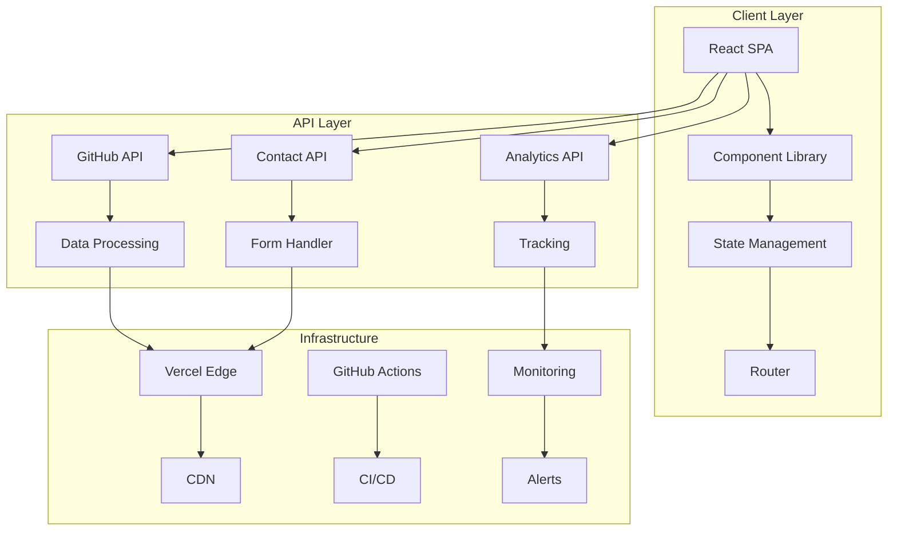

### Technology Stack Diagram

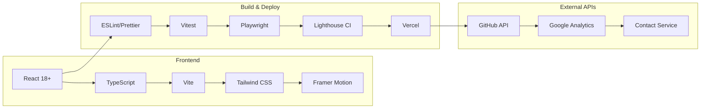

---

## 🧩 Component Design

### Component Hierarchy

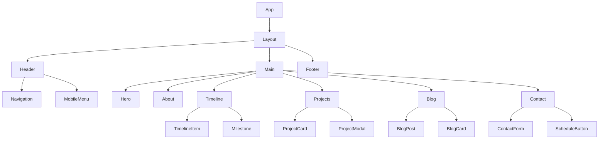

### Component Architecture Pattern

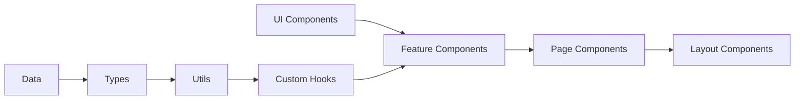

---

## 📊 Data Flow

### State Management Flow

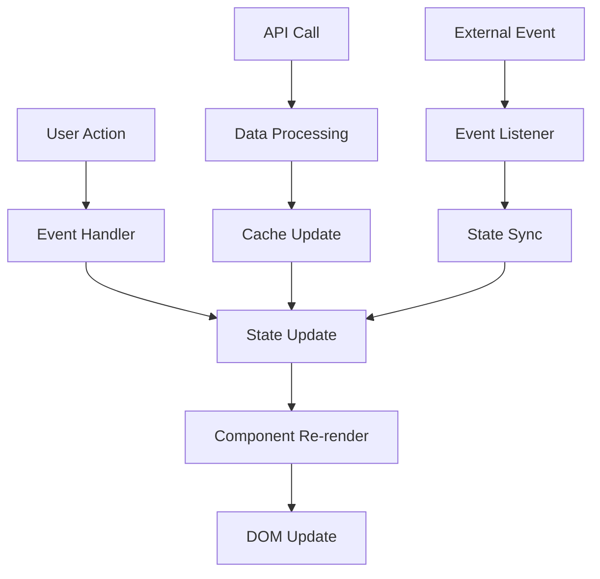

### Data Processing Pipeline

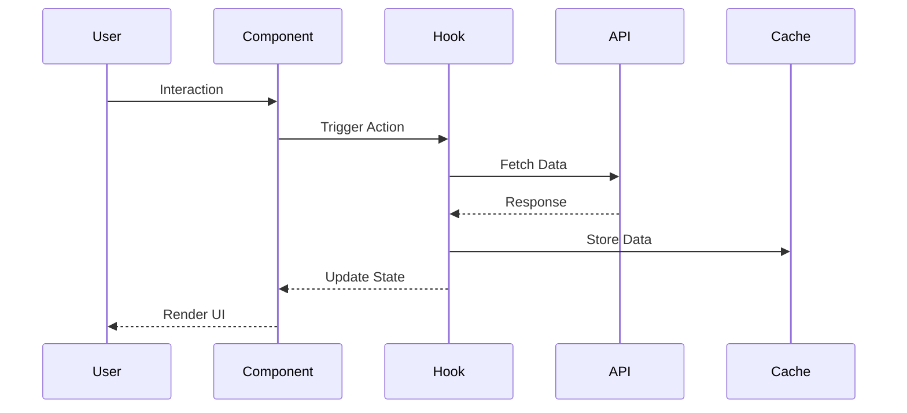

---

## ⚡ Performance Architecture

### Performance Optimization Strategy

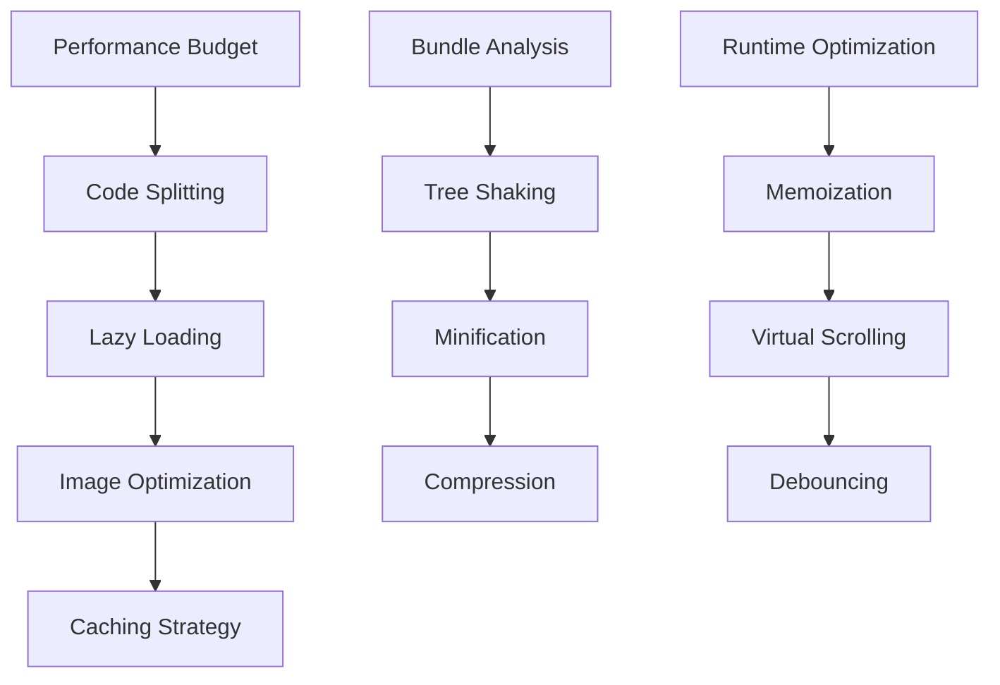

### Loading Strategy

```mermaid
gantt
    title Performance Loading Timeline
    dateFormat X
    axisFormat %s

    section Critical
    HTML Parse     :0, 0.2s
    CSS Parse      :0, 0.5s
    JS Parse       :0.2s, 0.8s

    section Above Fold
    Hero Render    :0.8s, 1.2s
    Navigation     :0.8s, 1.0s

    section Below Fold
    Timeline       :1.2s, 2.0s
    Projects       :1.5s, 2.5s
    Blog           :2.0s, 3.0s
```

---

## 🔐 Security Design

### Security Architecture

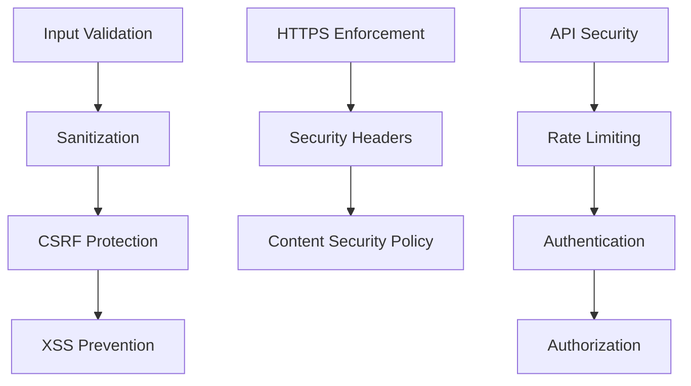

### Security Flow

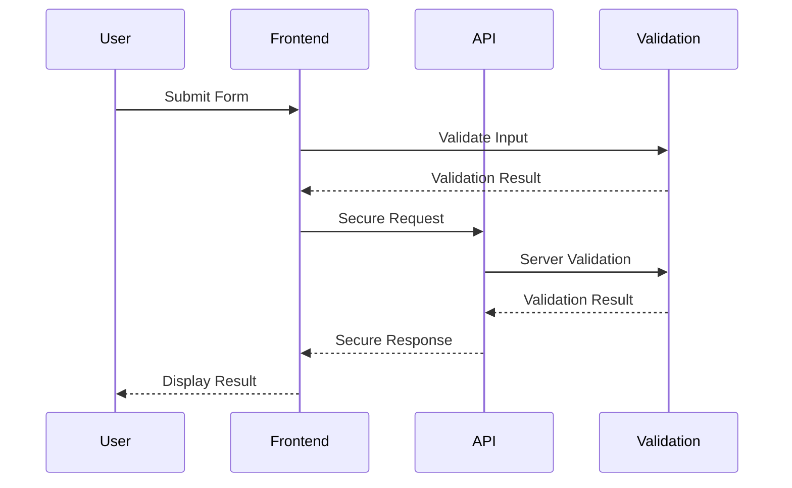

---

## 🗄️ Database Schema

### Content Structure

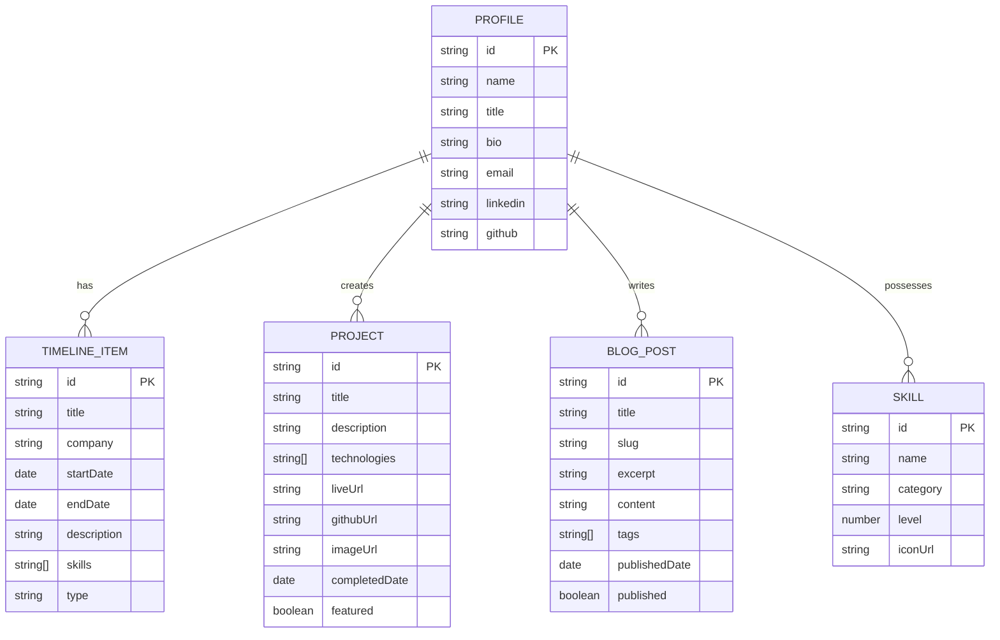

---

## 🔌 API Design

### API Architecture

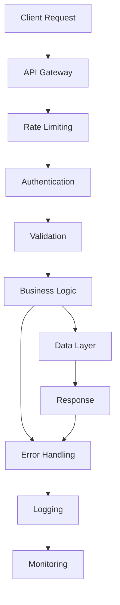

### API Endpoints

```mermaid
graph LR
    A[/api] --> B[/github]
    A --> C[/contact]
    A --> D[/analytics]
    A --> E[/health]

    B --> F[/repos]
    B --> G[/contributions]
    B --> H[/stats]

    C --> I[/send]
    C --> J[/schedule]

    D --> K[/track]
    D --> L[/events]
```

---

## 🧪 Testing Strategy

### Testing Pyramid

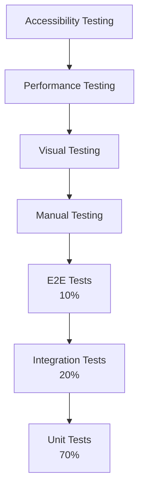

### Test Flow

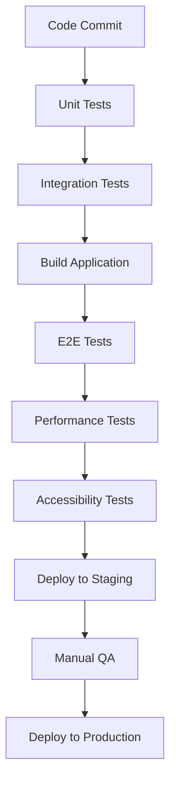

---

## 🚀 Deployment Architecture

### CI/CD Pipeline

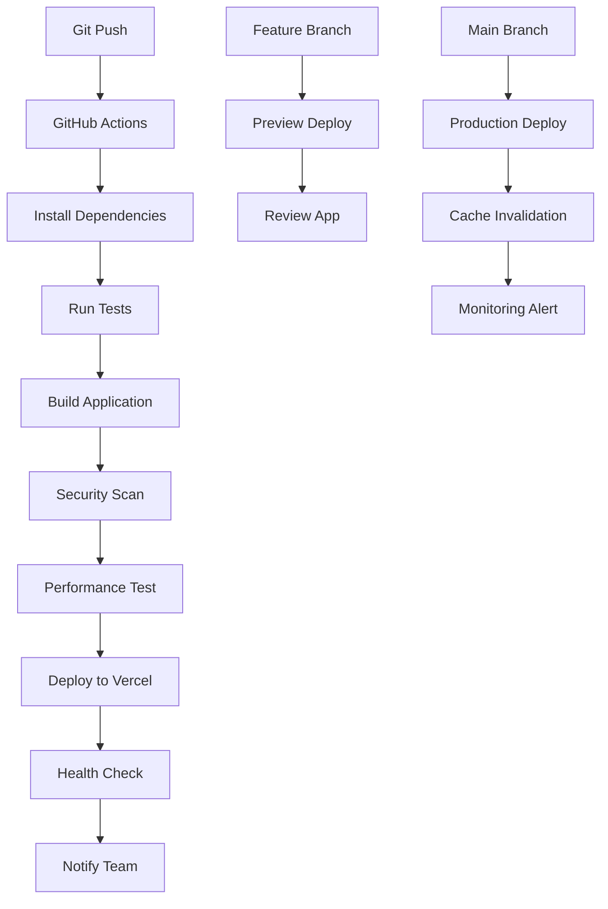

### Infrastructure Diagram

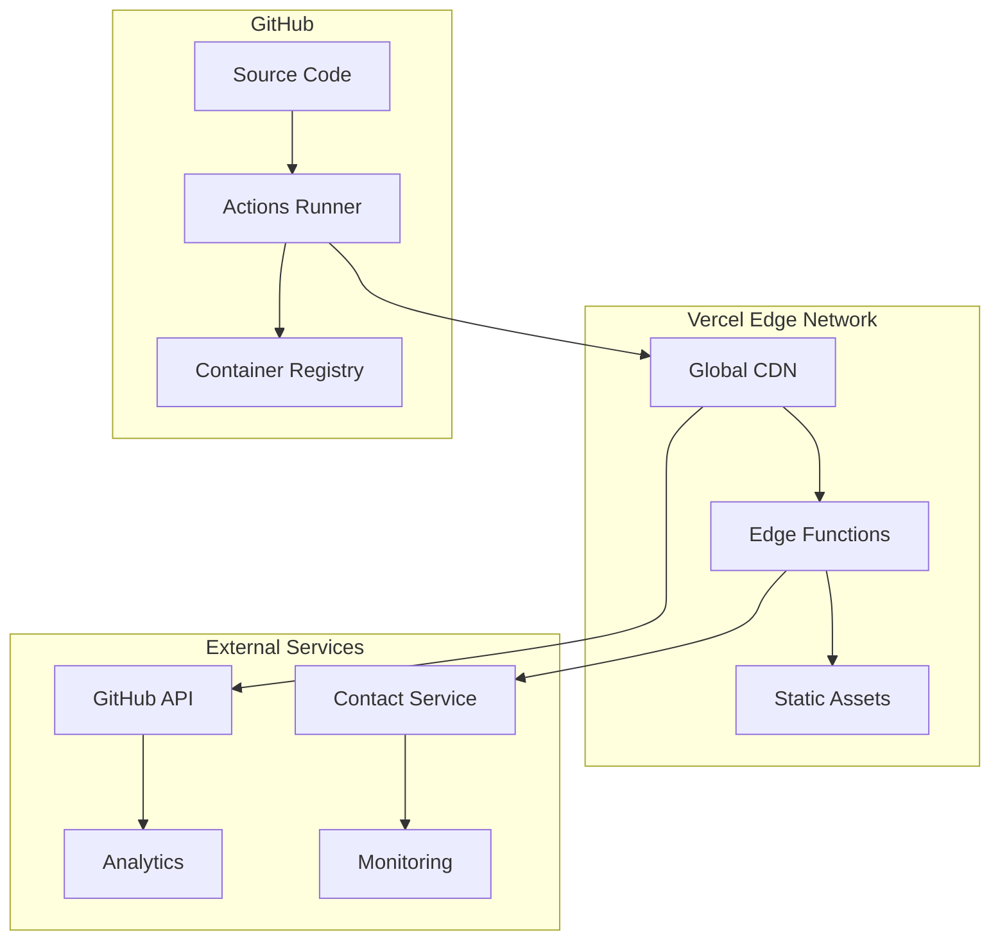

---

## 📈 Monitoring & Analytics

### Monitoring Architecture

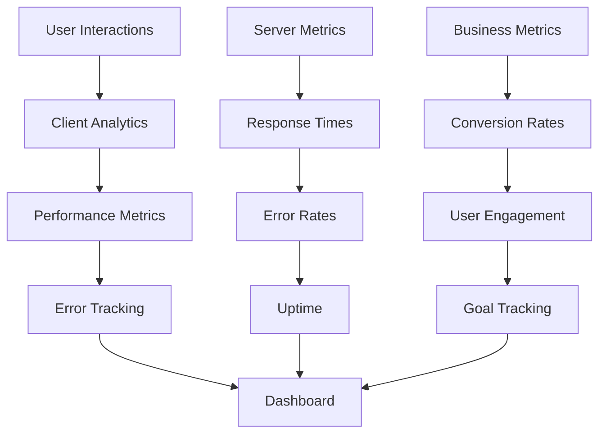

### Metrics Collection

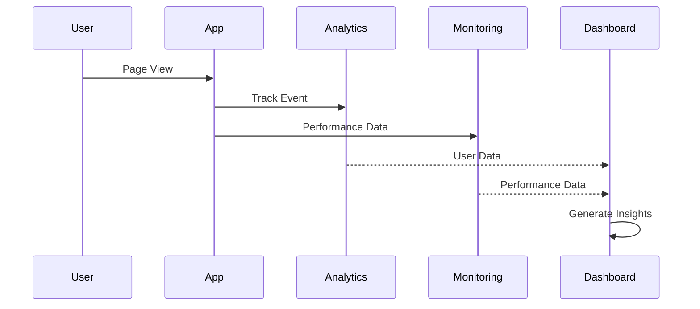

---

## 🔄 State Management

### Redux Pattern (if implemented)

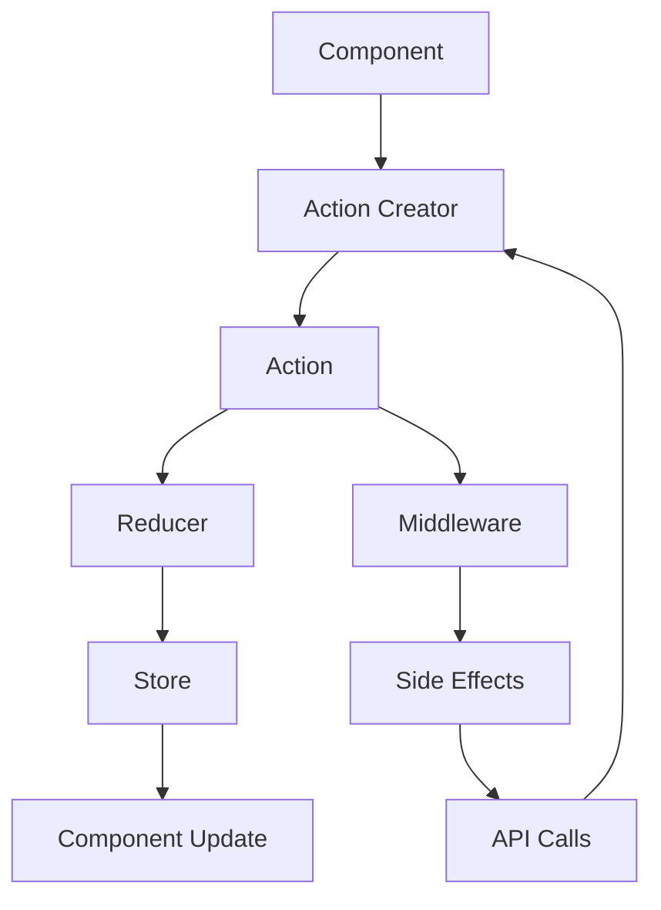

### Context API Pattern

```mermaid
graph TB
    A[Provider] --> B[Context]
    B --> C[Consumer Components]

    D[State Updates] --> A
    E[Side Effects] --> D
    F[User Actions] --> E

    C --> F
```

---

## 📱 Responsive Design System

### Breakpoint Strategy

```mermaid
graph LR
    A[Mobile<br/>320px-768px] --> B[Tablet<br/>768px-1024px]
    B --> C[Desktop<br/>1024px-1440px]
    C --> D[Large Desktop<br/>1440px+]

    E[Mobile First] --> A
    F[Progressive Enhancement] --> E
```

### Component Adaptation

```mermaid
flowchart TD
    A[Component] --> B{Screen Size}
    B -->|Mobile| C[Stack Layout]
    B -->|Tablet| D[Grid 2-col]
    B -->|Desktop| E[Grid 3-col]
    B -->|Large| F[Grid 4-col]

    C --> G[Touch Optimized]
    D --> H[Hybrid Navigation]
    E --> I[Hover Effects]
    F --> J[Advanced Features]
```

---

**Document Version:** 1.0  
**Last Updated:** August 3, 2025  
**Review Cycle:** Monthly updates with architecture changes
